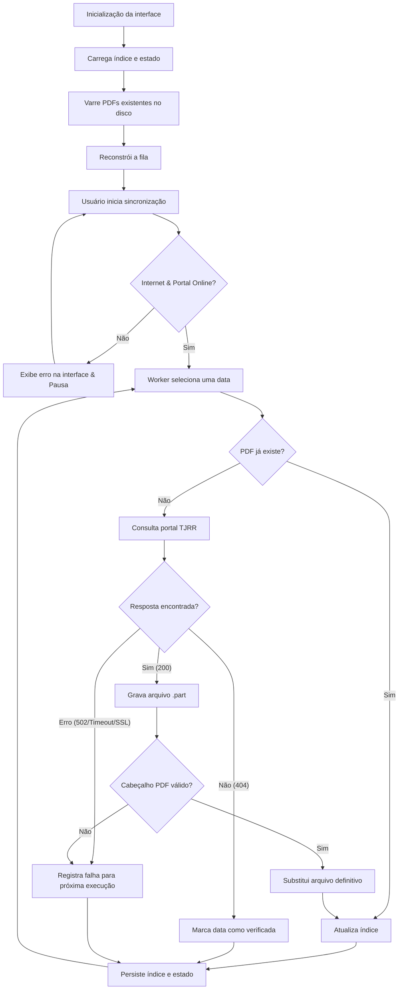

# Arquitetura

## Fluxo principal

## Persistência

O índice e o estado são gravados em JSON por substituição atômica: primeiro é criado um arquivo temporário e, depois da escrita completa, ele substitui o arquivo anterior. Isso reduz o risco de corrupção se o processo for interrompido durante a gravação.

Na inicialização, o aplicativo também varre a pasta de dados em busca de arquivos `dpj-AAAAMMDD.pdf` válidos. Isso permite restaurar apenas as pastas com PDFs de um backup; o `indice.json` será reconstruído conforme os arquivos forem encontrados. Quando não há índice restaurado, o PDF mais recente encontrado é usado como marco inicial para evitar uma nova verificação de todo o histórico.

A preparação local roda em uma thread de fundo e envia progresso para a interface. Durante essa fase, a barra mostra quantos arquivos foram analisados e as estatísticas exibem quantos PDFs válidos foram importados. A validação dos PDFs locais usa workers paralelos e o resultado da varredura é reaproveitado como cache na montagem da fila, evitando abrir os mesmos arquivos várias vezes. Intervalos grandes entre PDFs locais são tratados como lacunas do acervo e voltam para a fila de verificação.

O estado diferencia:

- `fila_restante`: datas ainda não iniciadas;
- `em_andamento`: datas submetidas ao executor;
- `falhas`: datas que devem ser tentadas em uma execução futura;
- contadores usados pela interface.

O índice diferencia PDFs encontrados (`pdfs`) de datas verificadas sem PDF (`datas_sem_pdf`). Essa separação evita que lacunas históricas já consultadas voltem para a fila em novas execuções.

Os PDFs também são escritos primeiro com a extensão `.pdf.part`. Somente arquivos iniciados pelo cabeçalho `%PDF` são promovidos para `.pdf`.

## Concorrência

`WorkerController` usa `ThreadPoolExecutor` porque o trabalho é predominantemente de rede e disco. O modo selecionado define o número de workers e um limitador compartilhado do tipo token bucket.

As consultas ao portal reutilizam uma sessão HTTP por thread para aproveitar conexões persistentes. A interface separa bytes baixados de datas consultadas por segundo, porque muitas datas históricas podem não possuir PDF e, nesse caso, há atividade de rede sem tráfego relevante de download.

| Modo | Limite agregado aproximado | Workers |
| --- | ---: | ---: |
| Lento | 1 MB/s | 2 |
| Rápido | 5 MB/s | 8 |
| Turbo | Ilimitado | 16 |

As mensagens dos workers chegam à interface por uma `queue.Queue`, evitando atualizações do Tkinter fora da thread principal.

## Melhorias futuras sugeridas

1. Separar as classes em um pacote `dje_finder`.
2. Adicionar cancelamento cooperativo das requisições em andamento.
3. Descobrir edições por uma fonte de catálogo, caso o TJRR disponibilize uma API.
4. Implementar pesquisa textual com extração/OCR opcional.
5. Adicionar tela de preferências para pasta, período e quantidade de workers.
6. Exibir histórico detalhado de falhas e permitir nova tentativa imediata.
