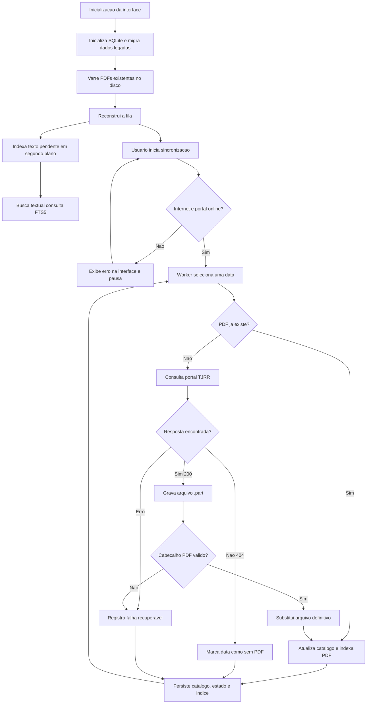

# Arquitetura

## Fluxo principal

## Persistencia

O estado principal fica em SQLite no arquivo `dje_finder.db`, dentro do diretorio de dados. O banco guarda:

- `pdfs`: datas com PDF local valido;
- `datas_sem_pdf`: datas em que o portal retornou 404 definitivo;
- `state`: fila restante, tarefas em andamento, falhas e contadores da interface;
- `indexed_pdfs`: status de indexacao textual por PDF;
- `pdf_pages_fts`: conteudo textual em FTS5, com uma linha por PDF.

Arquivos legados `indice.json` e `estado.json` ainda sao reconhecidos. Na inicializacao, quando existem, seus dados sao importados para SQLite e os arquivos originais sao renomeados para `.bak`.

A inicializacao tambem varre a pasta de dados em busca de arquivos `dpj-AAAAMMDD.pdf` validos. Isso permite restaurar apenas as pastas com PDFs de um backup; o catalogo sera reconstruido conforme os arquivos forem encontrados. Intervalos grandes entre PDFs locais sao tratados como lacunas do acervo e voltam para a fila de verificacao.

Os PDFs sao escritos primeiro com a extensao `.pdf.part`. Somente arquivos iniciados pelo cabecalho `%PDF` sao promovidos para `.pdf`.

## Indexacao textual

`PDFIndexer` usa PyMuPDF para extrair texto dos PDFs. A indexacao completa usa produtores em `ProcessPoolExecutor` para extracao e uma thread escritora unica para inserir no SQLite em lotes, reduzindo disputa de escrita.

O schema atual do FTS5 usa uma linha por PDF. Se um banco antigo com schema por pagina for encontrado, a tabela FTS5 e recriada e os PDFs voltam para a fila de reindexacao.

`PDFSearchEngine` concentra as consultas ao FTS5 para manter SQL fora da interface. A GUI chama esse modulo em uma thread de fundo e recebe os resultados pela mesma fila usada pelos workers, evitando travar o Tkinter.

A busca retorna resultados paginados, contagens por ano/mes, estatisticas de indexacao e caminhos dos PDFs locais. Ela oferece tres modos de correspondencia: todos os termos em qualquer ponto do documento, frase exata com os termos adjacentes e na mesma ordem, ou contexto proximo entre dois grupos de termos. Isso deixa a mesma camada pronta para uma futura interface Web sem duplicar regras de consulta.

No modo de contexto proximo, o FTS5 primeiro reduz os candidatos exigindo os dois grupos de termos. Em seguida, o Python valida se os grupos aparecem dentro da distancia configurada em palavras. Essa segunda etapa permite tratar nomes completos como frase e comparar proximidade com termos como `elogiar`, `nomear` ou `exonerar`.

## Interface Web

`streamlit_app.py` oferece uma interface Web local para consulta, usando o mesmo `PDFSearchEngine`. Ela nao executa sincronizacao nem indexacao; essas tarefas continuam no app desktop. A pagina espera encontrar `dje_finder.db` e os PDFs no diretorio de dados configurado.

Quando executada em rede local, outros computadores acessam a pagina servida pela maquina que esta rodando o Streamlit. Os dados continuam sendo lidos no computador servidor.

## Concorrencia

`WorkerController` usa `ThreadPoolExecutor` porque sincronizacao e predominantemente trabalho de rede e disco. O modo selecionado define o numero de workers e um limitador compartilhado do tipo token bucket.

As consultas ao portal reutilizam uma sessao HTTP por thread para aproveitar conexoes persistentes. A interface separa bytes baixados de datas consultadas por segundo, porque muitas datas historicas podem nao possuir PDF e, nesse caso, ha atividade de rede sem trafego relevante de download.

| Modo | Limite agregado aproximado | Workers |
| --- | ---: | ---: |
| Lento | 1 MB/s | 2 |
| Rapido | 5 MB/s | 8 |
| Turbo | Ilimitado | 16 |

As mensagens dos workers chegam a interface por uma `queue.Queue`, evitando atualizacoes do Tkinter fora da thread principal.

## Proximas melhorias sugeridas

1. Melhorar a experiencia da busca com destaque visual mais rico no trecho encontrado.
2. Adicionar tela de preferencias para pasta, periodo e quantidade de workers.
3. Exibir historico detalhado de falhas com nova tentativa imediata.
4. Adicionar logs rotativos em arquivo para facilitar suporte.
5. Avaliar OCR opcional para PDFs sem camada de texto.
6. Melhorar controles de acesso para uso em rede local quando necessario.
